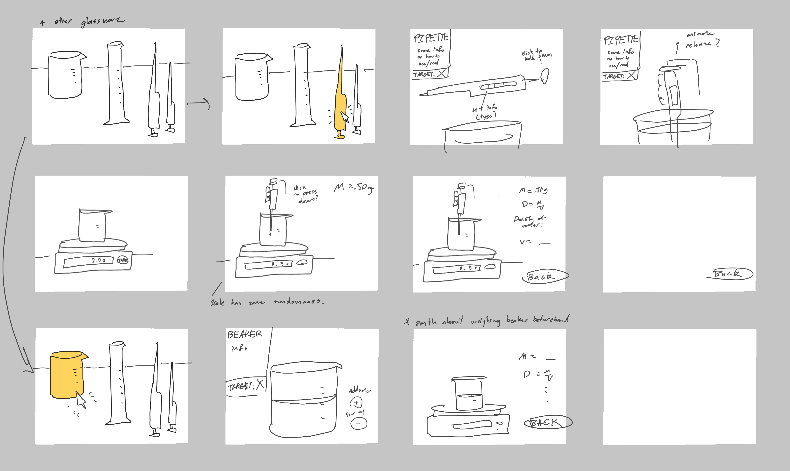

---
waltz:
  title: Educational Game Design Document Template
meta:
  version: 0.0.2
  gdd authors:
    - Zihan Wu
  template authors:
    - Austin Cory Bart <acbart@udel.edu>
    - Mark Sheriff
    - Alec Markarian
    - Benjamin Stanley
---

# Overview

Simulation to familarize students with glassware

## Core Gameplay Mechanics (Brief)

- Take up water
- Weigh water on scale
- Notes and calculations on mass -> volume

# Learning Aspects

## Learning Domains

Chemistry, lab equipment

## Target Audiences

College-aged, general chemistry students

## Target Contexts

Before lab time, to get an idea of what the lab will be like.

## Learning Objectives

- Students will be able to recognize and name more glassware.
- Be able to read glassware measurements correctly (meniscus, units)
- Can determine which wares should be used for specific scenarios - like if you want to get this amount of liquid, which tool would be better to use
- _TODO: Not sure if should include precision vs accuracy here or if this should just introduce how to use the glassware_

## Prerequisite Knowledge

- Students should be able to do basic subtraction/addition with units of measurement

## Assessment Measures

- What is the name of this piece of glassware?
- Given a pipette how would you use it?

# Player Interaction Patterns and Modes

## Player Interaction Pattern

One user can follow the minimal instruction on screen and click/drag where highlighted to interact.

## Player Modes

- Glassware selection: Pick a tool to use / learn about.
- Measurement: Use the tool picked to measure out a target amount?
- Notes: With the weighed water, calc the volume using the water's density and D=M/V. 

# Gameplay Objectives

- To transfer and weigh water and find the volume of the water.

# Procedures/Actions

Idea is to have a selection menu of glassware that one can click to zoom in and operate closer.

Each glassware piece in detail should clearly present the name and a quick blurb about what it's usually used for.

There is a glass on a zeroed scale and users can use the glassware to measure out a specific amount into the glass (deliver) to weigh it. 

Actions for measuring out water using the pipettes would be different from more container-like glassware. 

Include a notepad on side that auto records the mass and there can be a note about D = M/V to calculate volume from mass.

_Note: Minimum viable product - start with beaker and similar glassware. 
The main focus is on introduction to the glassware, don't make overly complicated. _

# Objects/Entities

* The scale
* All the glassware
* Possibly a notes section.

## Core Gameplay Mechanics (Detailed)

- Take up water
    - Details: Use mouse in some way to get water into glassware. Actions for taking up the water for pipettes vs for other glassware would have to be different. Graphically  might be a bit tricky if the glassware not uniform shape.
    - _Note: Pipets use a pi-pump to draw the liquid up above the line, remove pump and place thumb or finger over the top, slowly release liquid until liquid sits right on the calibration line. Burets (and graduated pipets) need to have a starting point and an ending point recorded._
Burets (and graduated pipets) need to have a starting point and an ending point recorded.
- Weigh and determine volume
    - Details: Scale gives back a number once you put water in the glass on it. More precise glassware should have less variation in the numbers.
    - How it works: Scale readings can correspond to lines on the glass readings - or could be fixed with some randomness.
- Calc mass -> volume
    - Details: A notes section after the weighing with formulas and a guide to how to calc. Mention water tempurature and how to get density from it. 
    - How it works: Could autofill once everything is over or a fill in the blank type section

## Feedback

- Water level rising when you fill the glassware.
- Warnings to take water out if user poors way past target amount.
- Prompts to retry the "taking up water" section if user sets pipettes wrong.
- At end, tells user how close to expected amount.

# Story and Gameplay
 

# Assets Needed

## Graphical

- Textures:
  - Water
- Environment Art/Textures:
  - All the glassware types _(buret, volumetric pipet, beaker, graduated cylinder, Erlenmeyer flask, volumetric flask, graduated pipet)_
  - Scale
  - Table

## Audio
  
- Sound List (SFX)
  - Pouring water sound
  - Some clinking glass sounds ideally
